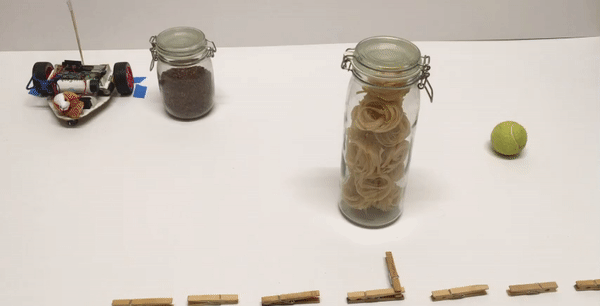

--- no-print ---
This is a **Scratch 3** project and requires a **Raspberry Pi 4**. There is also a [Physical computing for Scratch 1.4 project](https://projects.raspberrypi.org/en/projects/physical-computing-with-scratch14){:target="_blank"} where you can learn about programming LEDs, buzzers, and button switches, and a [Robot buggy project](https://projects.raspberrypi.org/en/projects/build-a-buggy){:target="_blank"}, both of which can be used with earlier Raspberry Pi models.
--- /no-print ---

--- print-only ---
This is a **Scratch 3** project and requires a **Raspberry Pi 4**. There is also a _Physical computing for Scratch 1.4_ project where you can learn about programming LEDs, buzzers, and button switches, and a _Robot buggy_ project, both of which can be used with earlier Raspberry Pi models.
--- /print-only ---

## Introduction

In this project you will learn how to wire and control button motors as electronic outputs, using a simple motor controller and a Raspberry Pi 4 that runs the latest version of Scratch. 
You'll make a robot buggy and write Scratch programs to control your robot buggy in different ways.

This projects follows on from the **LEDs, buzzers, and Scratch games (_outputs_)** and **Button switches, Scratch 3, and Raspberry Pi 4 (_inputs_)** physical computing projects, which both use Scratch 3 and a Raspberry Pi 4.

### What you will make

--- no-print ---

--- /no-print ---

--- print-only ---

--- /print-only ---

--- collapse ---
---
title: What you will need
---
### Hardware

+ A Raspberry Pi 4
+ A motor controller, such a the [CamJam EduKit 3 motor controller](https://thepihut.com/products/camjam-edukit-motor-controller){:target="_blank"}
+ 2 [gear motors](https://thepihut.com/products/adafruit-dc-gearbox-motor-tt-motor-200rpm-3-to-6vdc-ada3777){:target="_blank"}
+ 2 [wheels](https://thepihut.com/products/adafruit-black-multi-hub-wheel-for-tt-lego-or-n20-motor-65mm-diameter-ada4205){:target="_blank"} for the gear motors
+ A [roller ball castor](https://shop.pimoroni.com/products/pololu-ball-caster-with-3-4-metal-ball?variant=390424422){:target="_blank"} (or someting smooth, such as a table tennis ball)
+ A 4x AA battery box with on/off switch
+ Materials to make you robot buggy chassis

**Note:** Many low-cost gear motors are available without the wires already attached. These work fine, but unless you are going to solder the wires on yourself, you may find it difficult to connect the motor controller. If you decide to solder wires onto gear motors, take a look at the ['Build a robot buggy' project](https://projects.raspberrypi.org/en/projects/build-a-buggy/2){:target="_blank"}. There are also kits available that contain all the robot components you need, such as the [CamJam EduKit 3 Robotics kit](https://thepihut.com/products/camjam-edukit-3-robotics){:target="_blank"}.

### Software

+ Scratch 3 — if not already installed, open a terminal and type:

```bash
sudo apt install scratch3
```

Or go to main **Raspberry Pi menu** > **Preferences** > **Recommended Software**, and check the **Scratch 3** install box.

### Downloads

You can find the [completed project Scratch files here](http://rpf.io/p/en/motor-robot-buggy-scratch-get){:target="_blank"} and a [complete wiring image here](http://rpf.io/p/en/motor-robot-buggy-scratch-go){:target="_blank"}.

--- /collapse ---

--- collapse ---
---
title: What you will learn
---

+ To wire motors to a controller board and attach it to a Raspberry Pi
+ To code motors as electronic **outputs** in Scratch 3
+ To control your robot buggy in different ways using Scratch 3

--- /collapse ---

--- collapse ---
---
title: Additional information for educators
---

If you need to print this project, please use the [printer-friendly version](https://projects.raspberrypi.org/en/projects/motor-robot-buggy-scratch/print){:target="_blank"}.

You can find the [completed project Scratch files here](http://rpf.io/p/en/motor-robot-buggy-scratch-get){:target="_blank"} and a [complete wiring image here](http://rpf.io/p/en/motor-robot-buggy-scratch-go){:target="_blank"}.

--- /collapse ---
