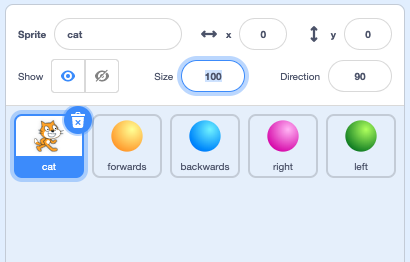

## Alternative visual remote

In **Scratch visual remote** you made a Scratch based remote which turned the motors **on** and **off** momentarily. An alternative to this is a remote that turns the motors on until given another instruction. In other words, the motors will not turn off automatically.

You could do this by simply removing the `wait`{:class="block3control"} and `set gpio pins low`{:class="block3extensions"} from each of the direction sprites but just to shake things up a little, you're going to try something a little different here.

In this section, you'll set your direction sprites to activate whenever the mouse pointer is over them and create a new **stop** sprite to turn the motors off.

--- task ---

Starting where you left off from the last **visual remote**, move the cat sprite out of the way and down to a corner to make way for a central **stop** sprite.

You can set the size in the sprite informtion box at the top of the sprite window.



It is good practice, however, and a good habit to get used to, to use code to set the size and other details.

For remote controls it is sometimes useful to stick to keyboard commands, so instead of using the green flag as an event, try using something else. The `SPACE` key is ideal being so easy to find.

Add a block from the looks block palette to `set the size to 50%`{:class="block3looks"}


```blocks3
when [space v] key pressed
set size to (50) %
```

NOTE: Your cat sprite should still have the _kill code_ that stops all motors.

--- /task ---

--- task ---


Move the cat sprite out of the way and down to a corner to make way for a central **stop** sprite.

You can set the size in the sprite informtion box at the top of the sprite window.


It is good practice, however, and a good habit to get used to, to use code to set the size and other details.

For remote controls it is sometimes useful to stick to keyboard commands, so instead of using the green flag as an event, try using something else. The `SPACE` key is ideal being so easy to find.

Add a block from the looks block palette to `set the size to 50%`{:class="block3looks"}


```blocks3
when [space v] key pressed
set size to (50) %
```

--- /task ---


--- task ---

Move 

Use the test codes from ***testing the motors with Scratch** to check what pins 7, 8, 9 and 10 control on _your_ robot buggy. This project will give examples based on the example robot so you may need to switch wires or adjust the code to suit your buggy.

```blocks3
when [7 v] key pressed
set gpio (7 v) to output [high v] ::extension
wait (0.1) seconds
set gpio (7 v) to output [low v] ::extension

when [9 v] key pressed
set gpio (9 v) to output [high v] ::extension
wait (0.1) seconds
set gpio (9 v) to output [low v] ::extension
```

--- /task ---

--- task ---