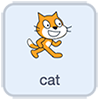

## Alternative visual remote

In the **Scratch visual remote** section, you made a Scratch-based remote which turned the motors **on** and **off** momentarily. An alternative to this is a remote that turns the motors on until given another instruction. In other words, the motors do not turn off automatically.

To do this, you could remove the `wait`{:class="block3control"} and `set gpio pins low`{:class="block3extensions"} from each of the direction sprites. But just to shake things up a little, you're going to try something a little different here.

In this section, you'll set your direction sprites to activate whenever the mouse pointer is over them and create a new **stop** sprite to turn the motors off.

--- task ---

Start where you left off from the last **visual remote** and move the cat sprite out of the way and down to a corner to make way for a central **stop** sprite.

You can set the size in the sprite informtion box at the top of the sprite window.


It is good practice, however, and a good habit to get used to, to use code to set the size and other details.

For remote controls it is sometimes useful to stick to keyboard commands, so instead of using the green flag as an event, try using something else. The **space** key is ideal being so easy to find.

Add a block from the looks block palette to `set the size to 50%`{:class="block3looks"}



```blocks3
when [space v] key pressed
set size to (50) %
```

**NOTE**: Your cat sprite should still have the _kill code_ that stops all motors.

--- /task ---

Next, let's look at the **forward** sprite.

The previous code turned the forward GPIO pins on, waited, and then turned them off again using the sprite being clicked as the _event_.


```blocks3
when this sprite clicked
set gpio (8 v) to output [high v] ::extension
set gpio (10 v) to output [high v] ::extension
wait (0.5) seconds
set gpio (8 v) to output [low v] ::extension
set gpio (10 v) to output [low v] ::extension

```

You'll change this to turn the motor forward GPIO pins on when the mouse pointer is _touching_ the forward sprite.

--- task ---

From the `events`{:class="block3events"} block palette, grab a `when space key pressed`{:class="block3events"} block.

Add a block to `set the size to 200%`{:class="block3looks"} or whatever works for you.


```blocks3
when [space v] key pressed
set size to (200) %
```

--- /task ---

--- task ---

Since you want the sprite to _always_ keep checking if the mouse pointer is touching the sprite, you need a `forever`{:class="block3control"} loop and a conditional `if... then...`{:class="block3control"} block.


```blocks3
when [space v] key pressed
set size to (200) %
+ forever
    if () then
+ end
```

--- /task ---

--- task ---

Next, add the _condition_ to be checked. Is the sprite touching the mouse pointer?


```blocks3
when [space v] key pressed
set size to (200) %
forever
    if <touching (mouse-pointer v) ? :: sensing +> then    
 end
```

--- /task ---

--- task ---

Inside the conditional `if... then...`{:class="block3control"} block, place the `set gpio`{:class="block3extensions"} blocks to turn the forward motors on.


```blocks3
when [space v] key pressed
set size to (200) %
forever
    if <touching (mouse-pointer v) ?> then
+        set gpio (8 v) to output [high v] ::extension
+        set gpio (10 v) to output [high v] ::extension
 end
```

--- /task ---

Now, whenever the mouse pointer touches the sprite, the forward motors turn on, but there is no code to turn them off again. In other words, until they receive another instruction from another sprite, the robot buggy continues to move forwards.

Since this rule also applies to the other direction sprites, you need to add code blocks to make sure any GPIO pins other than your **forwards** pins are turned off.

--- task ---

Add the `set gpio off`{:class="block3extensions"} blocks **before** the `set gpio on`{:class="block3extensions"} blocks just to make sure they are not all on at the same time.


```blocks3
when [space v] key pressed
set size to (200) %
forever
    if <touching (mouse-pointer v) ?> then
+        set gpio (7 v) to output [low v] ::extension
+        set gpio (9 v) to output [low v] ::extension
        set gpio (8 v) to output [high v] ::extension
        set gpio (10 v) to output [high v] ::extension
 end
```

To test the code, move the mouse pointer over the forward sprite and check that the motors turn forwards. Remember that there is no code to turn the motors off, but you can press the **q** key to activate the _kill code_.

--- /task ---

--- task ---

Repeat this code for the backwards, right, and left sprites, and use the correct GPIO pins for each direction.


```blocks3
when [space v] key pressed
set size to (200) %
forever
    if <touching (mouse-pointer v) ?> then
        set gpio (8 v) to output [low v] ::extension
        set gpio (10 v) to output [low v] ::extension
        set gpio (7 v) to output [high v] ::extension
        set gpio (9 v) to output [high v] ::extension
 end
```


```blocks3
when [space v] key pressed
set size to (200) %
forever
    if <touching (mouse-pointer v) ?> then
        set gpio (8 v) to output [low v] ::extension
        set gpio (9 v) to output [low v] ::extension
        set gpio (7 v) to output [high v] ::extension
        set gpio (10 v) to output [high v] ::extension
 end
```


```blocks3
when [space v] key pressed
set size to (200) %
forever
    if <touching (mouse-pointer v) ?> then
        set gpio (7 v) to output [low v] ::extension
        set gpio (10 v) to output [low v] ::extension
        set gpio (8 v) to output [high v] ::extension
        set gpio (9 v) to output [high v] ::extension
 end
```

--- /task ---

The only thing left to do is add a central **stop** sprite. A sprite in the centre of the the four _direction_ sprites that turns all GPIO pins low when touched by the mouse pointer.

--- task ---

Duplicate one of your _direction_ sprites as adjusting the code is much easier than starting from the beginning.

The **stop** sprite has much the same code but **all** GPIO pins are turned low.


```blocks3
when [space v] key pressed
set size to (200) %
forever
    if <touching (mouse-pointer v) ?> then
        set gpio (7 v) to output [low v] ::extension
        set gpio (8 v) to output [low v] ::extension
        set gpio (9 v) to output [low v] ::extension
        set gpio (10 v) to output [low v] ::extension
 end
```

--- /task ---

Now all the coding is done, test the program out. Press the **space** key to start and hover over the sprites to make your buggy move.

--- no-print ---

--- /no-print ---

--- print-only ---

--- /print-only ---

--- task ---

Think about how you would improve this remote control.

You may find it hard to look at the remote and where the mouse pointer was **and** see what the robot was doing at the same time. If this is the case, it would be useful to make the different direction sprites as large as possible on the screen.

--- no-print ---

--- /no-print ---

--- print-only ---

--- /print-only ---

--- /task ---


