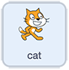

## Scratch keyboard remote

In this section you will overcome the issue of looking at the screen and trying to see what your robot buggy is doing at the same time by creating a keyboard remote control.

--- task ---

As usual, you will need to start with the motor _kill code_ that we have used in all our projects.

Create this code or start from a project that already has it leaving just a single sprite on which all your code will go.



```blocks3
when [q v] key pressed
set gpio (7 v) to output [low v] ::extension
set gpio (8 v) to output [low v] ::extension
set gpio (9 v) to output [low v] ::extension
set gpio (10 v) to output [low v] ::extension
stop [all v]
```

--- /task ---

The easiest way to code the keyboard remote would be to use `when key pressed`{:class="block3events"} events to trigger code that turns the motor GPIO pins on then off in a very similar way to the **Scratch visual remote** section, but you're about to use a way that is more complicated but far more responsive in use.

The first step is to make new Scratch blocks that define moving in each direction.

--- task ---

Go to the `My Blocks`{:class="block3myblocks"} block palette and click on the `Make a Block` button. Give the new block the name **forwards** and click **ok**.

A new event style block, `Define forwards`{:class="block3myblocks"} will appear in the red `My Blocks`{:class="block3myblocks"} colour.

```blocks3
define forwards
```

--- /task ---

--- task ---

Under the `Define forwards`{:class="block3myblocks"} block, add the two `set gpio`{:class="block3extensions"} blocks to turn the forward motors on.

```blocks3
define forwards
+ set gpio (8 v) to output [high v] ::extension
+ set gpio (10 v) to output [high v] ::extension
```

Nothing else is needed. No `wait`{:class="block3control"} or `set gpio low`{:class="block3extensions"}. This block is simply to _define_ what code makes the robot buggy go `forwards`{:class="block3myblocks"}.

--- /task ---

--- task ---

Now do the same for `backwards`{:class="block3myblocks"}, `right`{:class="block3myblocks"} and `left`{:class="block3myblocks"}.

```blocks3
define backwards
set gpio (7 v) to output [high v] ::extension
set gpio (9 v) to output [high v] ::extension

define right
set gpio (7 v) to output [high v] ::extension
set gpio (10 v) to output [high v] ::extension

define left
set gpio (8 v) to output [high v] ::extension
set gpio (9 v) to output [high v] ::extension
```

Note: It is not really necessary to make these `custom blocks`{:class="block3myblocks"} to make the code work, but it will make your code very easy to read and is a useful step before we move to the next section's **programmed maze journeys**.

--- /task ---

The default state for the GPIO pins when using the keyboard remote will be low (off) so you'll need a custom block for `stop`{:class="block3myblocks"} too.

--- task ---

Create a new block for `stop`{:class="block3myblocks"} which `sets gpio pins 7, 8, 9 and 10 low`{:class="block3extensions"}.

```blocks3
define stop
set gpio (7 v) to output [low v] ::extension
set gpio (8 v) to output [low v] ::extension
set gpio (9 v) to output [low v] ::extension
set gpio (10 v) to output [low v] ::extension
```

--- /task ---

The remaining keyboard code will be `sensing`{:class="block3sensing"} `if`{:class="block3control"} keyboard keys are being pressed and turning motors `on` or `off` accordingly.

--- task ---

Start with an event for the code. You could use the classic `green flag`{:class="block3events"} event if you like, but using a keyboard event such as the `space`{:class="block3events"} key has advantages for remote controls when you will not always be at a computer screen to see where the green flag is.

Since you want your code to keep on checking if a key is being pressed _forvever_ (as long as the program is running), pick a `forever`{:class="block3control"} loop and place it under your event.

```blocks3
when [space v] key pressed
forever
end
```

--- /task ---

Your code will check in turn if the `up`, `down`, `right` or `left` arrows are being pressed using _nested_ `if... then... else`{:class="block3control"} blocks.

Nested blocks are ones that fit inside each other in organised layers. You'll see how they fit together in a moment.

--- task ---

Grab an `if... then... else`{:class="block3control"} block and a `key space pressed?`{:class="block3sensing"} and put them together indside your forever loop.

Change the key from `space`{:class="block3sensing"} to `up arrow`{:class="block3sensing"}.

```blocks3
when [space v] key pressed
forever
+    if <key (up arrow v) pressed?> then
    else
    end
end
```

--- /task ---

--- task ---

Duplicate the `if... then... else`{:class="block3control"} block and set the new keys to `down arrow`{:class="block3sensing"}, `right arrow`{:class="block3sensing"} and `left arrow`{:class="block3sensing"}.

```blocks3
if <key (down arrow v) pressed?> then
else
end

if <key (right arrow v) pressed?> then
else
end

if <key (left arrow v) pressed?> then
else
end

```

--- /task ---

--- task ---

Add a motor movement `custom block`{:class="block3myblocks"} into each `if... then... else`{:class="block3control"} block below the `if`{:class="block3control"} `key pressed?`{:class="block3sensing"} `then`{:class="block3control"}.

Add `forwards`{:class="block3myblocks"} under the `up arrow`{:class="block3sensing"}, `backwards`{:class="block3myblocks"} under the `down arrow`{:class="block3sensing"} and so on.

```blocks3
when [space v] key pressed
forever
    if <key (up arrow v) pressed?> then
+        forwards :: myblocks
    else
    end
end

if <key (down arrow v) pressed?> then
+    backwards ::myblocks
else
end

if <key (right arrow v) pressed?> then
+    right :: my blocks
else
end

if <key (left arrow v) pressed?> then
+    left :: my block
else
end

```

--- /task ---

Now to _nest_ these conditional statements.

--- task ---

Start by inserting your `if`{:class="block3control"} `down arrow`{:class="block3sensing"} statement inside the `else`{:class="block3control"} section of your `if`{:class="block3control"} `up arrow`{:class="block3sensing"} statement.

--- no-print ---

--- /no-print ---

--- print-only ---

--- /print-only ---

```blocks3
when [space v] key pressed
forever
    if <key (up arrow v) pressed?> then
        forwards :: myblocks
    else
        if <key (down arrow v) pressed?> then
            backwards ::myblocks
        else
        end
    end
end

```

Your code now checks if the `up arrow`{:class="block3sensing"} is being pressed. 
+ `if`{:class="block3control"} it is `then`{:class="block3control"} the buggy will go `forwards`{:class="block3myblocks"}.
+ `else`{:class="block3control"} it will check if the `down arrow`{:class="block3sensing"} is being pressed.
And so on.

--- /task ---

--- task ---

Now do the same for the `right arrow`{:class="block3sensing"} and `left arrow`{:class="block3sensing"} statements.

First, the `right arrow`{:class="block3sensing"} statement goes into the `else`{:class="block3control"} section of your `if`{:class="block3control"} `down arrow`{:class="block3sensing"} statement.

--- no-print ---

--- /no-print ---

--- print-only ---

--- /print-only ---

```blocks3
when [space v] key pressed
forever
    if <key (up arrow v) pressed?> then
        forwards :: myblocks
    else
        if <key (down arrow v) pressed?> then
            backwards ::myblocks
        else
            if <key (right arrow v) pressed?> then
                right ::myblocks
            else
                if <key (left arrow v) pressed?> then
                    right ::myblocks
                else
                end
            end
        end
    end
end

```

And then the `left arrow`{:class="block3sensing"} statement goes into the `else`{:class="block3control"} section of your `if`{:class="block3control"} `right arrow`{:class="block3sensing"} statement.

--- /task ---

Almost there! Your code now checks if each `arrow key`{:class="block3sensing"} is being pressed in turn. If the first `arrow key`{:class="block3sensing"} is pressed, then GPIO pins are set high and the motors turn on, else the code checks the next `arrow key`{:class="block3sensing"} in the sequence. If no `arrow keys`{:class="block3sensing"} are being pressed then you need to tell all the motor GPIO pins to be set low.

--- task ---

Inside the final `else`{:class="block3control"} section, insert a `stop`{:class="block3myblocks"} block from `my blocks`{:class="block3myblocks"}.

```blocks3
when [space v] key pressed
forever
    if <key (up arrow v) pressed?> then
        forwards :: myblocks
    else
        if <key (down arrow v) pressed?> then
            backwards ::myblocks
        else
            if <key (right arrow v) pressed?> then
                right ::myblocks
            else
                if <key (left arrow v) pressed?> then
                    right ::myblocks
                else
                    stop :: My Blocks
                end
            end
        end
    end
end

```

And then the `left arrow`{:class="block3sensing"} statement goes into the `else`{:class="block3control"} section of your `if`{:class="block3control"} `right arrow`{:class="block3sensing"} statement.


