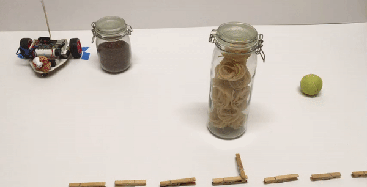

## Programmed maze journeys

In this section, you'll adapt your custom `My Blocks`{:class="block3myblocks"} and then use them to pre-program your robot buggy to navigate through a maze or obstacle course.

--- task ---

Start with the code you used for **Scratch keyboard remote**. Keep your _kill code_, and `custom movement blocks`{:class="block3myblocks"} for `forwards`{:class="block3myblocks"}, `backwards`{:class="block3myblocks"}, `right`{:class="block3myblocks"}, and `left`{:class="block3myblocks"}.

You do not need any of the code in you `forever`{:class="block3control"} loop or the `stop`{:class="block3myblocks"} block, so throw those away.

--- /task ---

Now, you're going to add to your `custom movement blocks`{:class="block3myblocks"} so that each `sets gpio pins high`{:class="block3extensions"}, `waits`{:class="block3control"}, and then `sets gpio pins low`{:class="block3extensions"} again.

The clever coding here is to build the `wait time`{:class="block3control"} into the `custom blocks`{:class="block3myblocks"}.

Let's start with the `define forwards`{:class="block3myblocks"} block.

--- task ---

Under the `set gpio high`{:class="block3extensions"} blocks, add a `wait`{:class="block3control"} block.

Beneath that, add `set gpio low`{:class="block3extensions"} blocks for the same GPIO pins that you just turned high.

```blocks3
define forwards
set gpio (8 v) to output [high v] ::extension
set gpio (10 v) to output [high v] ::extension
+ wait (1) seconds
+ set gpio (8 v) to output [low v] ::extension
+ set gpio (10 v) to output [low v] ::extension
```

--- /task ---

Now for the clever part.

--- task ---

Right-click on the `define forwards`{:class="block3myblocks"} block and choose `edit`.

In the dialogue box, click on the `Add an input: number or text` button.

Next, a new input entry appears in the `forwards`{:class="block3myblocks"} block above. Give this input entry the name **time** and click `OK`.

From your `define forwards`{:class="block3myblocks"} block, which now reads `define forwards (time)`{:class="block3myblocks"}, drag the round `time`{:class="block3myblocks"} bubble into the `wait`{:class="block3control"} block's input bubble.


```blocks3
define forwards (time :: custom +) :: custom
set gpio (8 v) to output [high v] ::extension
set gpio (10 v) to output [high v] ::extension
wait (time :: custom +) seconds
set gpio (8 v) to output [low v] ::extension
set gpio (10 v) to output [low v] ::extension
```

--- /task ---

Have a look at how this has changed the `forwards`{:class="block3myblocks"} block in the `My Blocks`{:class="block3myblocks"} block palette.

```blocks3
forwards () :: custom
```
The `forwards`{:class="block3myblocks"} block now has a new input field in which you can enter the amount of time that the GPIO pins will wait until turning off.

```blocks3
forwards (0.5) :: custom
```

`forwards 0.5`{:class="block3myblocks"} tells the robot buggy to go forwards for 0.5 seconds.

--- task ---

Repeat the last step, add a `time`{:class="block3myblocks"} input for the `time`{:class="block3myblocks"}, `time`{:class="block3myblocks"} and `time`{:class="block3myblocks"} custom blocks.

```blocks3
define backwards (time :: custom) :: custom
set gpio (7 v) to output [high v] ::extension
set gpio (9 v) to output [high v] ::extension
wait (time :: custom) seconds
set gpio (7 v) to output [low v] ::extension
set gpio (9 v) to output [low v] ::extension

define right (time :: custom) :: custom
set gpio (7 v) to output [high v] ::extension
set gpio (10 v) to output [high v] ::extension
wait (time :: custom) seconds
set gpio (7 v) to output [low v] ::extension
set gpio (10 v) to output [low v] ::extension

define left (time :: custom) :: custom
set gpio (8 v) to output [high v] ::extension
set gpio (9 v) to output [high v] ::extension
wait (time :: custom) seconds
set gpio (8 v) to output [low v] ::extension
set gpio (9 v) to output [low v] ::extension
```

--- /task ---

You have now defined all of your `custom`{:class="block3myblocks"} blocks and it is time to make a maze or obstacle course to challenge yourself or someone else.

--- task ---

Create your own maze or obstacle course.

The rules are up to you! Make sure that you have enough space for the robot to get through the maze and decide what happens, for example, if the robot touches a boundary. Perhaps your course has objects that the robot must knock over, or avoid, or even a mix of the two!


--- /task ---

Once you have made your course, it is time to use your `custom`{:class="block3myblocks"} blocks to code the robot's journey. 

It takes trial and error to get the right code. Each time you go wrong, think about whether you need to increase or reduce the time for each move or turn.

Program one step at a time, check it, and only go onto the next block of code once you have everything right up to that point.

--- task ---

Start with the `space`{:class="block3events"} key event block and add a `forwards`{:class="block3myblocks"} block from the `My Blocks`{:class="block3myblocks"} block palette.

Estimate how long you need to go forwards (this depends on the obstacle course or maze that you have created). Enter this in the blank field of the `forwards`{:class="block3myblocks"} block.

```blocks3
when [space v] key pressed
forwards (1) :: custom
```
Make sure your robot is at your chosen starting spot and press `space`.

Did it go where you wanted? Do you need to increase the time, reduce the time or move onto the next step?

--- no-print ---

--- /no-print ---

--- print-only ---

--- /print-only ---

In the example, the robot buggy went too far, so the time needs to be reduced.

```blocks3
when [space v] key pressed
forwards (0.5) :: custom
```

--- no-print ---

--- /no-print ---

--- print-only ---

--- /print-only ---

NOTE: You need to make sure the robot goes back to the exact same place and faces the exact same way. Otherwise you'll get different results each time and it will become almost impossible to get it right. 

Use bits of tape or other markers to mark where your robot needs to start each time.


--- /task ---

--- task ---

Add a `turn`{:class="block3myblocks"} block depending on what your robot needs to do. In the example, the robot buggy needs to turn left. Estimate how long the turn needs to be and put that in the blank input field.

```blocks3
when [space v] key pressed
forwards (0.5) :: custom
left (0.4) :: custom
```

Try it out. If it wasn't right, work out how you need to adjust it and try again.

--- no-print ---

--- /no-print ---

--- print-only ---

--- /print-only ---

--- /task ---

You might well find that you made your maze far too hard for a first maze. A challenge is good but if it gets frustrating, don't be afraid to alter your maze to make it a challenge but within reach.

--- no-print ---

--- /no-print ---

--- print-only ---

--- /print-only ---

--- task ---

Keep trying it out and add the `blocks`{:class="block3myblocks"} you need until you finish your challenge!

```blocks3
when [space v] key pressed
forwards (0.5) :: custom
left (0.4) :: custom
forwards (0.45) :: custom
left (0.2) :: custom
forwards (0.6) :: custom
right (0.35) :: custom
forwards (1) :: custom
```

--- no-print ---

--- /no-print ---

--- print-only ---

--- /print-only ---

--- /task ---

