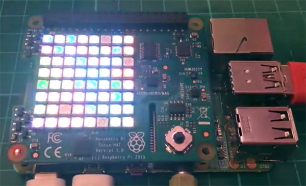

## What next?

- Why not have a go at other **[physical computing projects using Scratch](https://projects.raspberrypi.org/en/projects?software%5B%5D=scratch&hardware%5B%5D=electronic-components)**
- Or explore the fabulous [SenseHAT using Scratch](https://projects.raspberrypi.org/en/projects?software%5B%5D=scratch&hardware%5B%5D=sense-hat)

