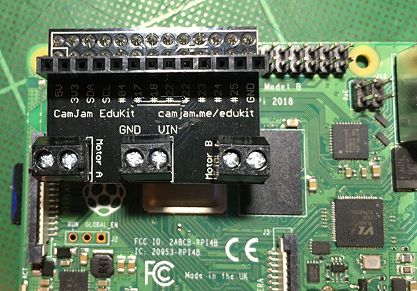

## Setting up your motors

There are two common ways to connect a **motor controller** to your Rapsberry Pi 4 depending on the controller you have.
+ Plugging it straight onto the GPIO pins
+ connecting it using jumper cables or wires

A common and very inexpensive motor controller is the L298N Dual H Bridge DC Stepper Motor Driver Controller Board which you would connect using jumper cables and wires. If you have this kind of controller, there are simple instructions on how to connect it in the [Python build a robot buggy project](https://projects.raspberrypi.org/en/projects/build-a-buggy/2){:target="_blank"}.

The instructions here are for a [CamJam EduKit 3 motor controller](https://thepihut.com/products/camjam-edukit-motor-controller){:target="_blank"} which simply fits straight on top of the Pi's GPIO pins.

The controller fits to the end GPIO pins nearest the edge of the board with the body of the controller facing inwards over the Raspberry Pi.

Most _plug on_ motor controller boards have a similar format with a **power in** terminal, a **negative** terminal and then a **positive** and **negative** terminal for each motor output. In most cases, the Pi still needs its own power supply and a battery pack is used to power the motors via the controller.

**Note:** It is important to get the battery pack polarity correct but when connecting the motors polarity is not essential, it simply affects which GPIO pin controls forwards or backwards.