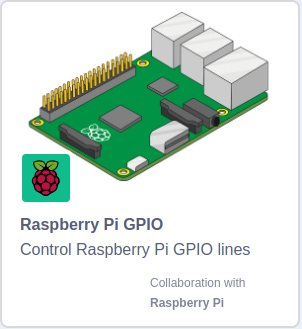

## Testing the motors with Scratch

Any motor controller for two motors will use four GPIO pins to send signals to the motors.
+ Motor A clockwise
+ Motor A counter-clockwise
+ Motor B clockwise
+ Motor B counter-clockwise

For the CamJam EduKit motor in these instructions, the GPIO pin numbers are 7 and 8 for motor A, and 9 and 10 for motor B.

Let's write some simple code to test that everything is working and which pin makes each wheel go in each direction.

--- task ---

Open Scratch 3 and load the **Raspberry Pi GPIO** extension.

To do this, click on the add an extension button and choose the `Raspberry Pi GPIO` extension.



--- /task ---

First of all, you're going to write a software _kill code_ script to stop all the motors. If ever anything unexpected happens, just press **q** to stop the motors.

--- task ---

Grab a `when space key pressed`{:class="block3events"} event block and change the event key to **q**.

```blocks3
when [q v] key pressed
```

--- /task ---

--- task ---

Add a `forever`{:class="block3control"} loop.

```blocks3
when [q v] key pressed
+ forever
end
```

--- /task ---

--- task ---

from the Raspberry Pi GPIO block palette, add a block that says `set gpio 7 to output low`{:class="block3extensions"}.

Add this block into the `forever`{:class="block3control"} loop.

```blocks3
when [q v] key pressed
forever
+   set gpio (7 v) to output [low v]
end
```

--- /task ---
