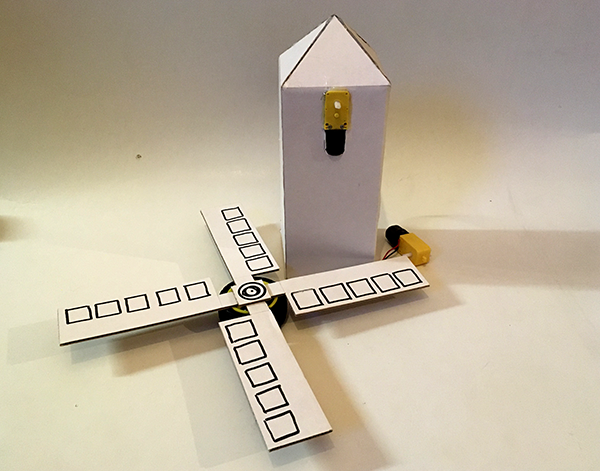
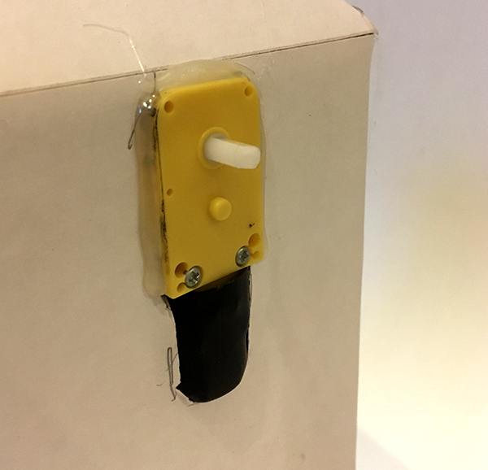
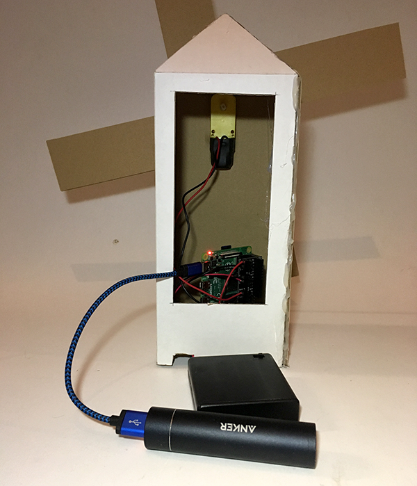
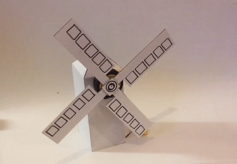
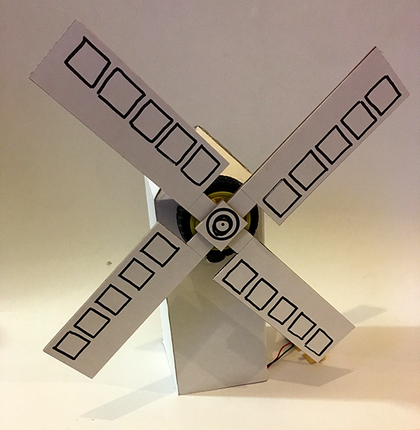

## What are motors for?

You have two motors and two wheels. You can control them in Scratch now that you know what each GPIO pin does.

What next? **What** can you do with two motors?

The obvious answer is to build a motorised buggy but with a little imagination, there's much more you could do.

What do you **want** your motor to do?

### Anything that spins?

Since the gear motor turns, you could make something that spins. It could be ferris wheel, a helicopter, a merry-go-round, or how about a windmill?

--- task ---

Decide what you want to make, collect some materials and make it!

If you can't decide what to make, how about making a windmill, just like this example.

Think about where the motor will need to go for your project to work.



--- /task ---

The example windmill uses the wheel as a base for the windmill _sails_. If your project also used the wheels, make sure that the motor is fixed to your project in a way that doesn't make the wheel rub against anything.

**Note:** The easiest way to attach the motor for a windmill is to stick it stright to the outside of the windmill building.



In the example, the back of the windmill is cut out to make access to the inside much easier.



--- task ---

Once you have constructed your project, open Scratch 3 and start coding.

Your project will need different code depending on what you are trying to achieve but to make a simple motor on/off, code one keyboard key to set the correct pin on and another to turn it off.

```blocks3
when [up arrow v] key pressed
set gpio (7 v) to output [high v] ::extension

when [down arrow v] key pressed
set gpio (7 v) to output [low v] ::extension
```

Press the **up** key to see your project working.

--- no-print ---

--- /no-print ---

--- print-only ---

--- /print-only ---

--- /task ---

You may want to have your project motor turn in either direction and be able to change direction.

Remember that GPIO pin 7 and 8 do opposite things, i.e. one moves the motor forward and the other moves it backwards, so you don't want both on (high) at the same time!

--- task ---

Add a block to make sure GPIO pin 8 is turned off before pin 7 turns on.

```blocks3
when [up arrow v] key pressed
+   set gpio (8 v) to output [low v] ::extension
set gpio (7 v) to output [high v] ::extension

when [down arrow v] key pressed
set gpio (7 v) to output [low v] ::extension
```

--- /task ---

--- task ---

Add equivalent blocks to turn GPIO pin 8 on and off. Again, make sure that pin 7 is turned **off** before pin 8 turns on.

```blocks3
when [right arrow v] key pressed
set gpio (7 v) to output [low v] ::extension
set gpio (8 v) to output [high v] ::extension

when [left arrow v] key pressed
set gpio (8 v) to output [low v] ::extension
```

Try pressing the **up**, **down**, **right** and **left** keys to make your project working backwards and forwards. 

--- /task ---

### Project on a timer

You might want your project to work automatically on a timer. For instance, the windmill could turn on for 2 seconds and then turn off for quarter of a minute.

--- task ---

Start with the `when green flag clicked`{:class="block3events"} event block.

Add a `forever`{:class="block3control"} loop so that the timed on/off will carry on until the program is stopped.

```blocks3
when flag clicked
forever
end
```

--- /task ---

--- task ---

Inside the `forever`{:class="block3control"} loop, add a block to turn GPIO pin 7 on and then add a `wait`{:class="block3control"} for as long as you want the motor to be on for, e.g. 2 seconds.

```blocks3
when flag clicked
forever
+   set gpio (7 v) to output [high v] ::extension
+   wait (2) seconds
end
```

--- /task ---

--- task ---

Under that, add a block to turn GPIO pin 7 off again and a `wait`{:class="block3control"} for the time that you want before the motor starts again, e.g. quarter of a minute (15 seconds).

```blocks3
when flag clicked
forever
set gpio (7 v) to output [high v] ::extension
wait (2) seconds
+   set gpio (7 v) to output [low v] ::extension
+   wait (15) seconds
end
```

Click the green fag to check that your project works as expected and play around with the wait times till they work as you like.

**Note:** If you stop the program while the motor is running, it will carry on running because the GPIO pin has been left high (on).

--- /task ---
