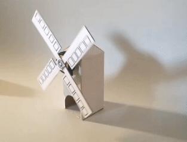
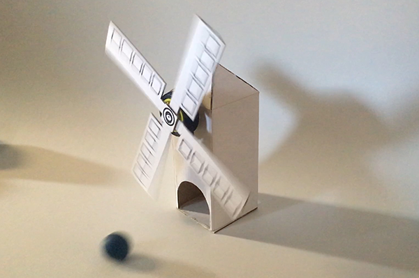
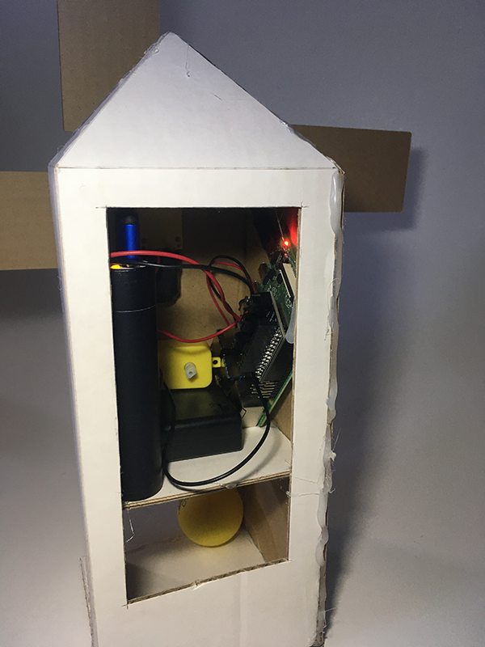
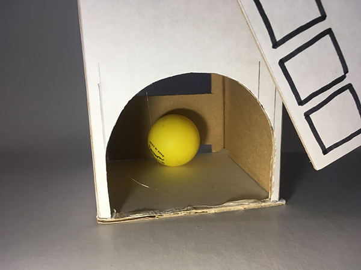

## Challenge: Adapt your motor project

This is a very open challenge to give you the freedom to make it your own.  

It's time to take your project from the last section (or use another if you like) and turn it into something else! You can adapt it and improve it in some way you had not originally considered.

The changes could involve more making, more coding or both! There is no right or wrong approach here. You are the judge of whether the change is an improvement or not.

If you feel overwhelmed by open possibilities, how about turning your creation into a _crazy golf_ obstacle where you have to try and get a ball past your moving obstacle?

The crazy golf idea doesn't need to end there. You could have a moving obstacle to try and get a remote control buggy past, or something else, like a Sphero. Use whatever you can get your hands on!

--- no-print ---



--- /no-print ---

--- print-only ---



--- /print-only ---

### Crazy golf

What you will need to do for a crazy golf project:
+ Have a target or destination for the ball (or robot) to get to
+ Code your obstacle to move in a way that makes getting past possible, but not too easy

For the example windmill, a hole has been cut in the front of the mill and the **target** is to get a ball **inside** the windmill itself!

You'll probably come across unexpected issues as you go. The Raspberry Pi and battery box used to sit at the bottom of the windmill, so they needed to find a new home.

--- task ---

Adapt your project model so that there is space for the Raspberry Pi, battery box, etc., to be stored, and so that there is a target for the ball. 

**Note:** The target does not have to be a part of your original project model. The target could be somewhere _beyond_ your obstacle where the ball needs to pass your obstacle safely.

In the example project, a shelf was needed to the electronics.



A hole in the front of the tower created the target destination inside the windmill.



--- /task ---

--- task ---

Next, you will need to adapt your code for this new purpose.

In this example, let's start with the code from the last section for the windmill.

```blocks3
when flag clicked
forever
set gpio (7 v) to output [high v] ::extension
wait (2) seconds
set gpio (7 v) to output [low v] ::extension
wait (15) seconds
end
```

How can you change this code to make a fun crazy golf obstacle?

--- /task ---

--- hints ---

--- hint ---

To make the challenge hard, which also makes it fun, you will need to:

+ turn the windmill off (only for a very short time)
+ make it hard to predict when the windmill will start and stop

--- /hint ---

--- hint ---

It is easy to make it hard to predict when the windmill will start and stop. Just add `random number`{:class="block3operators"} blocks to your `wait`{:class="block3control"} times.

You also need to make the numbers **much** lower. Experiment with what works best in your project. The windmill example used `wait`{:class="block3control"} times between `0.1`{:class="block3control"} and `1.5 seconds`{:class="block3control"} only!

--- /hint ---

--- hint ---

The code below worked for the windmill crazy golf obstacle, but play with the numbers to find what works best for you and your project.

```blocks3
when flag clicked
forever
set gpio (7 v) to output [high v] ::extension
wait (pick random (0.1) to (1.5) :: operators +) seconds
set gpio (7 v) to output [low v] ::extension
wait (pick random (0.3) to (1.2) :: operators +) seconds
end
```

--- /hint ---

--- /hints ---


