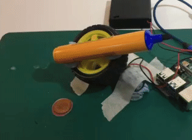
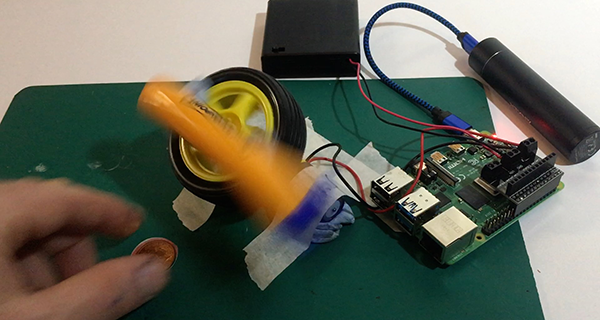
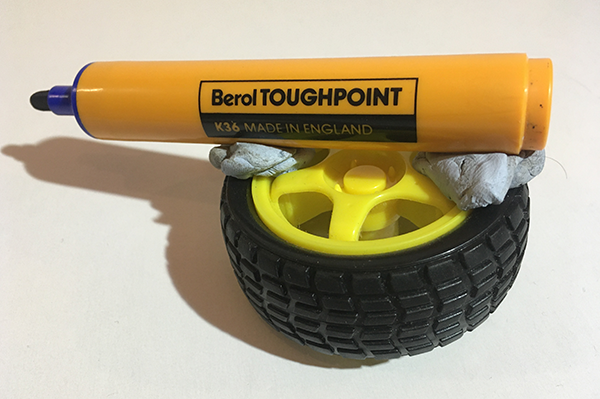
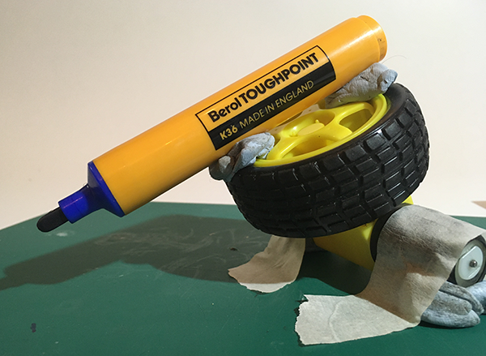
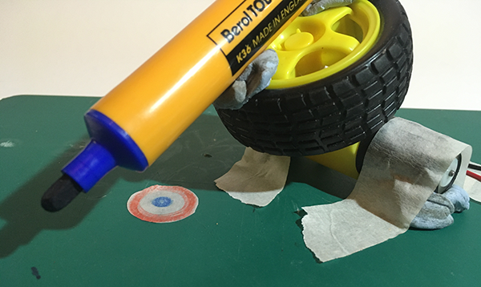
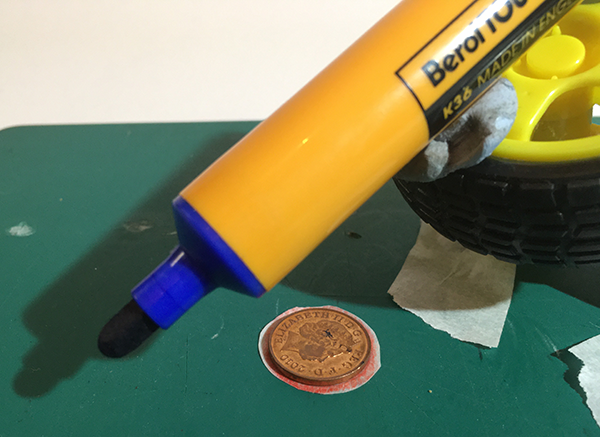

## Reaction game

There are so many things that you can use a motor to make. Why not make a piece of moving art, a motorised scene from history, a winch, or maybe something that nobody ever thought of before?

Have a go at this simple reaction game and then try to make something of your own.

The idea is to have a target, maybe an object to take, that the player needs to get to. The motor drives a pen or stick that the player needs to avoid.

--- no-print ---



--- /no-print ---

--- print-only ---



--- /print-only ---

--- task ---

Stick a pen to one of your wheels. Masking tape or Blu Tack works fine for this.

If you prefer, you could use a stick or straw, which can help you avoid covering your fingers in pen ink!



--- /task ---

--- task ---

Attach the wheel to your motor and fix it to your playing surface. You could use a table, a board, or even a piece of stiff cardboard so you can move it around.

In the example, the motor is stuck on blobs of Blu Tack and then masking tape is used to keep it in upright.

Angle the motor as you like to protect your chosen target spot.



--- /task ---

--- task ---

Next comes the target: something you need to touch, retrieve, place, or even make. Your game might have a small jigsaw the player needs to make or something to draw before the pen gets you. It can be whatever you like.

In this example, there's a small target and a coin to retrieve and then place back exactly on the target spot before being **marked** by the pen.

Place your target down in the place that is most protected and the hardest to get to.



Then add the object to retrieve and place.



--- /task ---

That's all the making done, unless you need to adjust something once you see how it works when it is running.

Now let's code your pen trap.

First of all, you're going to program a _kill code_ to turn the motor off. You need to do this because if you simply stop the program when the motor is running, the motor keeps on spinning because that was the last instruction it had, or more precisely, because that GPIO pin remains _high_.

--- task ---

Select an `event`{:class="block3events"} key for your _kill code_. This example uses the **q** key for **q**uit.

Set both GPIO pins, in this case 9 and 10 for motor 2, to `output low`{:class="block3extensions"}.

Finally, add a `stop all`{:class="block3control"} to stop the GPIO pins being turned on again.

```blocks3
when [q v] key pressed
set gpio (9 v) to output [low v] ::extension
set gpio (10 v) to output [low v] ::extension
stop [all v]
```

Since this code only turns the GPIO pins low (off), you need to write some code to turn the pins high to test it out.

--- /task ---

Now you can write the code to make the motor turn on and off.

--- task ---

Select an `event`{:class="block3events"} key to start the reaction game. Previously you used the `green flag`{:class="block3events"}, but this example uses the `SPACE`{:class="block3events"} key.

Pull out a `forever`{:class="block3control"} loop from the control palette to make the code keep repeating as long as the program is running.

```blocks3
when [space v] key pressed
forever
end
```

--- /task ---

Next, turn the motor **on** using GPIO pin 9 and then turn it **off** again using a very short wait to get the timing of the motor's motion.

--- task ---

Take two `set gpio`{:class="block3extensions"} blocks. One for **on** and one for **off**.

Place these inside the `forever`{:class="block3control"} loop, each with a `wait`{:class="block3control"} block after it.

Set the two `waits`{:class="block3control"} for a very short time, e.g. 0.8 seconds after you have turned the pin high and 0.5 seconds after you have turned it low again.

```blocks3
when [space v] key pressed
forever
+   set gpio (9 v) to output [high v] ::extension
+   wait (0.8) seconds
+   set gpio (9 v) to output [low v] ::extension
+   wait (0.5) seconds
end
```

Press `SPACE`{:class="block3events"}, or whatever event you chose, and see how it works.

Press `q`{:class="block3events"} when you want the motor to stop.

--- /task ---

The pen should spin for a moment and then stop for an even shorter time. The short stop makes it hard to reach the target in time, but at the moment you always know how long it stops for and which way it spins, so there are some obvious ways to improve the game.

+ randomise the amount of time it spins
+ randomise the amount of time it stops
+ randomise the direction the pen spins

Let's randomise the timing first.

--- task ---

Inset a `pick random`{:class="block3operators"} block into each of the `waits`{:class="block3control"} and set them for a random very short range, e.g. 0.4 to 1.2 seconds for on and 0.1 to 0.8 seconds for off.

```blocks3
when [space v] key pressed
forever
   set gpio (9 v) to output [high v] ::extension
   wait (pick random (0.4) to (1.2) :: operators +) seconds
   set gpio (9 v) to output [low v] ::extension
   wait (pick random (0.1) to (0.8) :: operators +) seconds
end
```

Press `SPACE`{:class="block3events"} again to see the changes.

--- /task ---

The new random timing should make the game much harder and more exciting, but if you randomise the direction of the pen, the game becomes even harder!

To do this, create a `variable`{:class="block3variables"} called `direction`{:class="block3variables"}, set to 9 or 10 at the start of each repeat of the `forever`{:class="block3control"} loop.

Then, instead of `setting gpio`{:class="block3extensions"} `9`, `set gpio`{:class="block3extensions"} to the value of the `direction`{:class="block3variables"} variable, i.e. either 9 or 10.

Since the variable could be 9 0r 10 for each repeat, the direction of the motor could be forwards or backwards for each repeat.

Try it out.

--- task ---

In the variables block palette, create a new `variable`{:class="block3variables"} and call it `direction`{:class="block3variables"}.

Take a `set variable`{:class="block3variables"} block for `direction`{:class="block3variables"} and place it inside the `forever`{:class="block3control"} loop, right at the top.

```blocks3
when [space v] key pressed
forever
+   set [direction v] to ()
   set gpio (9 v) to output [high v] ::extension
   wait (pick random (0.4) to (1.2)) seconds
   set gpio (9 v) to output [low v] ::extension
   wait (pick random (0.1) to (0.8)) seconds
end
```

--- /task ---

--- task ---

To set `direction`{:class="block3variables"} to 9 or 10, add a `pick random`{:class="block3operators"} block and set the range from 9 to 10.

Add a round `direction`{:class="block3variables"} variable block in place of `9` in each of the `set gpio`{:class="block3extensions"} blocks.

```blocks3
when [space v] key pressed
forever
   set [direction v] to (pick random (9) to (10) :: operators +)
   set gpio (direction :: variables +) to output [high v] ::extension
   wait (pick random (0.4) to (1.2)) seconds
   set gpio (direction :: variables +) to output [low v] ::extension
   wait (pick random (0.1) to (0.8)) seconds
end
```

Press `SPACE`{:class="block3events"} to try out your new randomised direction pen code.

Play around with the timings to find the right values for you.

--- /task ---

