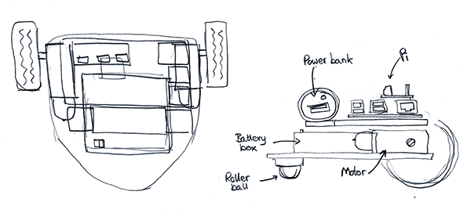
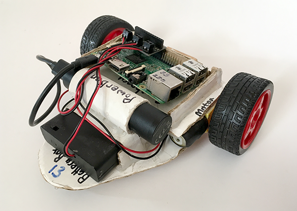
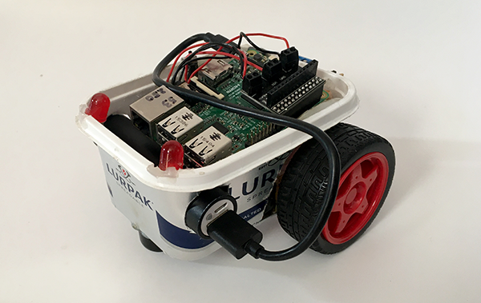
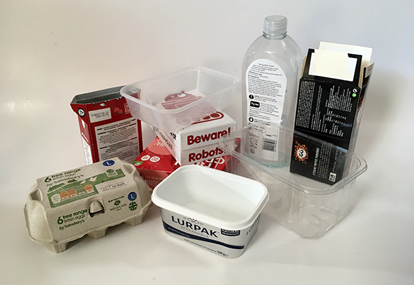
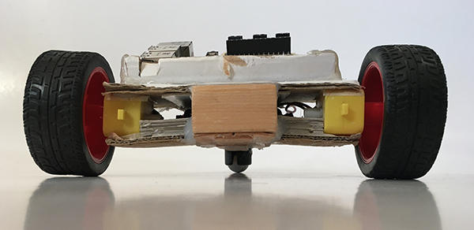

## Making a robot buggy

Robot buggies are a really popular making and coding project and once you have a robot that can drive around there are all sorts of ways to adapt it and grow you project, like adding lights and even sensors.

Let's start by looking at the robot's chassis - the basic body of your robot buggy.

--- task ---

The first thing you will need to do is look at the materials that you have, think about the materials you want and can get hold of and about the design of your robot buggy.

Your robot buggy will need to have:

+ A base to fix the motors and roller wheel to, and to support your electronics
+ A gear motor on each side - usually at the back but they could go near the front
+ A roller ball - placed to make your robot buggy stable

Your robot buggy will need to hold:

+ A Raspberry Pi 4
+ A 4xAA battery box
+ A power supply for the Raspberry Pi, e.g. a USB powerbank

--- /task ---

--- task ---

Make a quick design sketch of what your buggy will look like and importantly, where all your components will fit.

The sketch above showed that the size of the chassis (the buggy's main body) would be dictated by the combined width of the two gear motors and the battery box. I laid them out on a piece of cardboard to see how wide the chassis would need to be.

--- /task ---

There is no problem with adapting your design as you go along and you find problems, possibilities or your ideas change. The design sketch above resulted in this robot buggy. Small, compact and functional but yours can be whatever you want it to be!

--- task ---

Make a quick design sketch of what your buggy will look like and importantly, where all your components will fit.

The sketch above showed that the size of the chassis (the buggy's main body) would be dictated by the combined width of the two gear motors and the battery box. I laid them out on a piece of cardboard to see how wide the chassis would need to be.

--- /task ---

