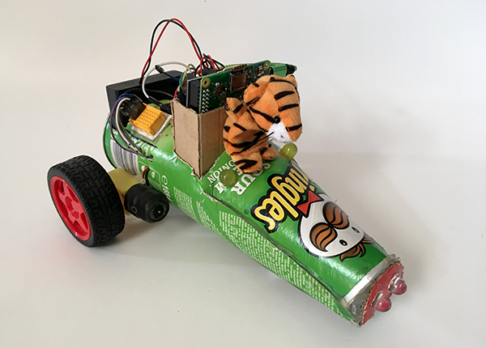

## How to make a robot buggy

Robot buggies are a really popular project and once you have a robot that can drive around there are all sorts of ways to adapt it and grow you project, you could add lights, or even sensors!

Let's start by looking at the robot's chassis — the basic body of your robot buggy.

--- task ---

The first thing you need to do is think about the design of your robot buggy. Look at the materials that you have, and think about the materials you can easily get hold of. 

Your robot buggy needs to have:

+ A base to fix the motors and roller wheel to, and to support your electronics
+ A gear motor on each side — usually at the back but they could go near the front
+ A roller ball — placed to make your robot buggy stable

Your robot buggy needs to hold:

+ A Raspberry Pi 4
+ A 4xAA battery box
+ A power supply for the Raspberry Pi, e.g. a USB power bank

--- /task ---

--- task ---

Make a quick design sketch of what you want your buggy to look like and importantly, where all your components fit.

The sketch above showed that the size of the chassis (the buggy's main body) would be dictated by the combined width of the two gear motors and the battery box. These items have been laid out on a piece of cardboard to see how wide the chassis needs to be.

--- /task ---

You can adapt your design as you go along and you find problems, possibilities, or your ideas change. The design sketch above resulted in this robot buggy. It's small, compact, and functional — but yours can be whatever you want it to be!

--- task ---

Make a quick design sketch of what you want your buggy to look like and importantly, where all your components fit.

The sketch above showed that the size of the chassis (the buggy's main body) would be dictated by the combined width of the two gear motors and the battery box. I laid them out on a piece of cardboard to see how wide the chassis would need to be.

--- /task ---

You do not need the perfect box for a robot buggy. Chances are you may find a great box, pieces of cardboard, or other packaging around your home, school, or wherever you are.

It does not have to be any certain size or shape. You can experiment, evaluate, and reinvent your robot as you often as you like.

You might want to use a piece of packaging just as it comes, make adjustments to an exisiting packet, or make your own chassis from scratch.

Hot melt glue guns are not necessary but are an ideal tool for putting your robot buggy together.

Have your motors secured both below and above, like a _motor sandwich_, makes them stable. Your robot is able to drive much better if the motors are firmly in place. 

