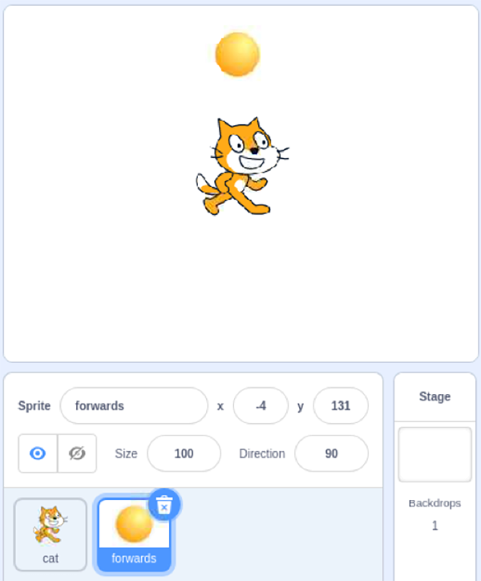
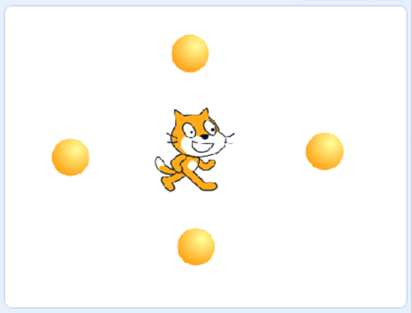

## Scratch visual remote

Hopefully, you can now access your Raspberry Pi remotely, with RealVNC. If you cannot, do not worry. You can still code your buggy robot with cables attached.

From the motor/GPIO pin test codes in the third section in the example, you know that:

+ **GPIO pin 7** makes the right motor go backwards
+ **GPIO pin 8** makes the right motor go forwards
+ **GPIO pin 9** makes the left motor go backwards
+ **GPIO pin 10** makes the left motor go forwards

This means that if you want the buggy to go forwards, you need to turn **GPIO pins 8 and 10** high.

Similarly, if you want to turn **right**, you need the left motor to go forwards while the right motor turns backwards. So you should turn **GPIO pins 7 and 10** high.

--- task ---

Use the test codes from **test the motors with Scratch** to check what pins 7, 8, 9, and 10 control on _your_ robot buggy. This project gives examples based on the example robot, so you may need to switch wires or adjust the code to suit your buggy.

```blocks3
when [7 v] key pressed
set gpio (7 v) to output [high v] ::extension
wait (0.1) seconds
set gpio (7 v) to output [low v] ::extension

when [9 v] key pressed
set gpio (9 v) to output [high v] ::extension
wait (0.1) seconds
set gpio (9 v) to output [low v] ::extension
```

--- /task ---

--- task ---

Start by coding the _kill code_ to turn all motors off in case you find that your buggy runs away when you're not expecting it to!

```blocks3
when [q v] key pressed
set gpio (7 v) to output [low v] ::extension
set gpio (8 v) to output [low v] ::extension
set gpio (9 v) to output [low v] ::extension
set gpio (10 v) to output [low v] ::extension
stop [all v]
```

--- /task ---

What you are going to do now is add a sprite for each direction: forwards, backwards, right, and left. Then, code each to turn the correct GPIO pins high to make the buggy move in that direction.

--- task ---

Add a sprite to go forwards.



Rename the sprite **forwards** to keep your program clear.

The code is pretty much the same for each direction, so it is easier to finish one and then duplicate that sprite.

--- /task ---

--- task ---

Make sure that you have selected your **forwards** sprite and give it the code to `set the forwards gpio pins high`{:class="block3extensions"}, `wait`{:class="block3control"}, and then `turn the pins low`{:class="block3extensions"} when the `sprite is clicked`{:class="block3events"}.


```blocks3
when this sprite clicked
set gpio (8 v) to output [high v] ::extension
set gpio (10 v) to output [high v] ::extension
wait (0.2) seconds
set gpio (8 v) to output [low v] ::extension
set gpio (10 v) to output [low v] ::extension

```

Try it out. Click the sprite and your buggy should move forwards for a moment. 

Try and change the wait time to give a different amount of movement.

**NOTE**: You might find that the robot moves slightly to the side at the beginning and end of the move. This is just because of the GPIO pins turning on and off a split-second after each other. 

If your buggy veers clearly in one direction throughout the move, then your wheels are probably a little wonky.

If the buggy turns sharply or goes backwards, you are turning the wrong pins **high**.

--- /task ---

--- task ---

Next, duplicate the **forwards** sprite. Right-click on its icon in the _sprites window_ and click **duplicate**.

Rename the new sprite **backwards**, and move it to the bottom of the stage as the backwards button.

Change the GPIO pin values to send your robot backwards.


```blocks3
when this sprite clicked
set gpio (7 v) to output [high v] ::extension
set gpio (9 v) to output [high v] ::extension
wait (0.2) seconds
set gpio (7 v) to output [low v] ::extension
set gpio (9 v) to output [low v] ::extension

```

Try your new button out. Try going backwards and then forwards.

--- /task ---

--- task ---

Repeat this step for the **right** and **left** controls.




```blocks3
when this sprite clicked
set gpio (7 v) to output [high v] ::extension
set gpio (10 v) to output [high v] ::extension
wait (0.2) seconds
set gpio (7 v) to output [low v] ::extension
set gpio (10 v) to output [low v] ::extension
```


```blocks3
when this sprite clicked
set gpio (8 v) to output [high v] ::extension
set gpio (9 v) to output [high v] ::extension
wait (0.2) seconds
set gpio (8 v) to output [low v] ::extension
set gpio (9 v) to output [low v] ::extension
```

If you changed the wait times to much more than 0.2 seconds, you may want to reduce it back for the right and left turns to be able to get a fine control over how much you turn. 

For the example robot buggy, to turn right for 0.5 seconds meant a rotation of roughly 90°.

--- /task ---

You're done! Get driving!

With the example buggy, 0.5 seconds for forwards and backwards, and 0.1 seconds for right and left was ideal. Repeatedly clicking on the sprites created a pretty good continuous movement.  

Think about how you might improve the remote. Even things like bigger buttons can make a difference.


